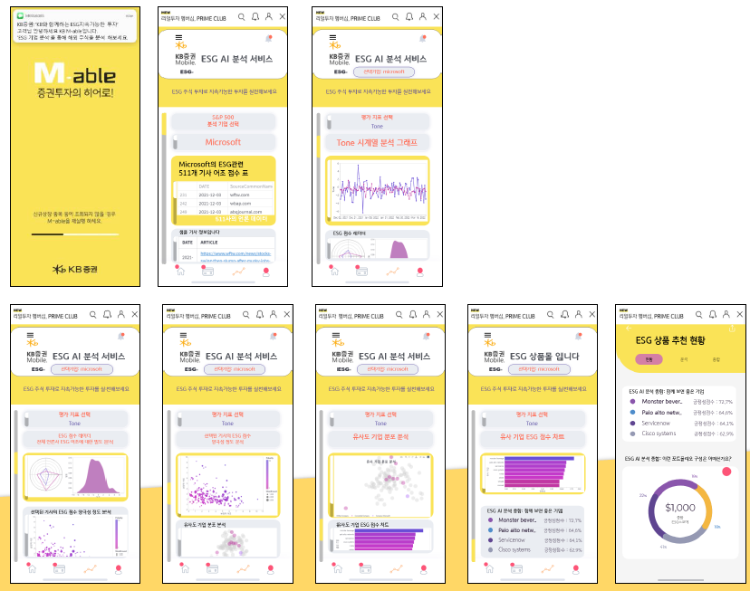
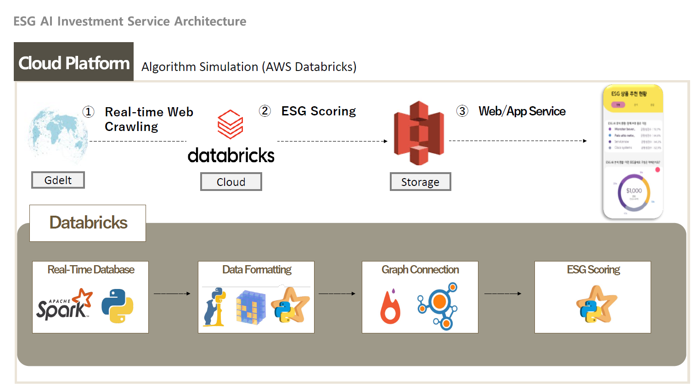
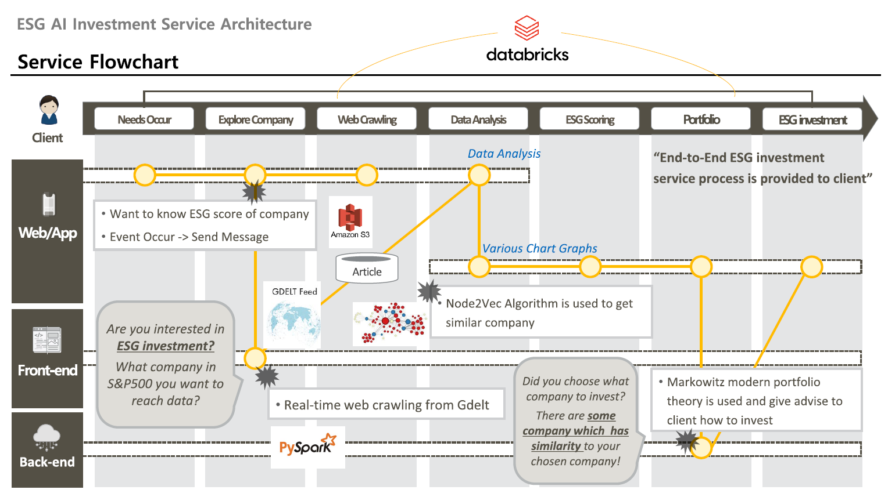

# ESG-investment with AI
### Winner of KB Digital Idea Market with 4th Rank

***This repository is referenced by [ESG_AI](https://github.com/hannahawalsh/ESG_AI) 
which is [Hack to the Future 2020](https://devpost.com/software/esg-ai) 
Winner: Best Environmental Impact & Best User Experience***
<br></br>
**Demonstrating the power of Streamlit.** [  




## Project Flow
### This project's flow is,
- s&p500's 90% of enterprises reveal sustainability report every year.
- But we do not have standard evaluation format to get score of ESG.
- So crawlling the article from gdelt, and analyze tone of article about ESG and then scoring with the word that used in article 
- At scoring, gdelt databse is used.
- At porfolio creation, Node2Vec and Markowitz portfolio theory are used. 
<br></br>

## What is difference between benchmark github?
### Markowitz Portfolio
- I added additional service for personal investor to get example portfolio based on modern portfolio theory.

**With above services I added, user can reach more diverse information for ESG investment!**
<br></br>

## Data Crawling & Creation with Databricks 
Firstly, You have to sign up or sign in Databricks. You can use free trial for 14 days.
In Databricks, you can use pyspark very easily which can makes data crawling really fast!
 - Create your own workspace
 - Go to setting - Admin Console - Workspace Settings and set whatever you like to (I recommend Git, Web Terminal, DBFS File Browser enable)
 - Go to Compute and Create your own Cluster (If you are connected with AWS, it will create EC2 automatically)
 - Go to Repos and Create your own folder and notebooks (You can use Data_Creation folder!). Then run with your own cluster.
 - Go to Data and Select DFBS folder. You can see Data is created as csv!
<br></br>

Here are some magic codes for using Databricks for no conflict with python packages :)
1. If you get error with pip install gdelt
   ```bash
   python -m pip install gdelt --use-deprecated=backtrack-on-build-failures
   ```
2. If you get pkg version error, then reinstall it!
   ```bash
   pip install [pkg==ver] --force-reinstall
   ```

Also, You can download DBFS data files that you created at your local computer!
 - Go to User Settings - Access Tokens, then Generate New Token
 - In your local computer, install [Anaconda](https://www.anaconda.com/)
 - Open Anaconda prompt and install [databricks-cli](https://docs.databricks.com/dev-tools/cli/index.html)
   ```bash
   python -m pip install databricks-cli
   ```
 - You have to define your host and token
   ```bash
   databricks configure --token
   ```
   - You have to copy workspace url
   - You can generate token at your databricks workspace "user setting"
 - To check databricks-cli is well installed, type this command
   ```bash
   databricks fs -h
   ```
 - If databricks-cli is well installed, you can now download(=copy) DBFS folder to your local computer
   ```bash
   databricks fs cp -r [spark file path] [your local directory path] 
   ```
 - Then you can now access your data at your local computer to make streamlit web!
<br></br>

### Why we use databricks?
Databricks is an American enterprise software company founded by the creators of Apache Spark.
Databricks develops a web-based platform for working with Spark, that provides automated cluster management and IPython-style notebooks. 
[Wikipedia](https://en.wikipedia.org/wiki/Databricks)

***We can Create and Manage Data parallely with PySpark and this is really fast!***

### Why we need data crawlling and important rule to follow!
1. You must have to include December or January when crawling data!
   - This is important point, because year end and start is the evaluation period of company.
   - So you can get superior quality and quantity of article.

2. The number of article that crawled means the power or influence of company to society (ex. 421 press make article about Netflix)
   - This means, you can get rough information such as company's trending degree from number of article
<br></br>

### What method is used to Scoring ESG?
***Gdelt and PySpark is used!***

### What method is used to form Portfolio?
***Node2Vec and Markowitz Portfolio Theory is used!***

- you can see more detail explanation about Node2Vec at [here](https://snap.stanford.edu/node2vec/)
- you can see more detail explanation about Markowitz Portfolio at [here](https://towardsdatascience.com/efficient-frontier-portfolio-optimisation-in-python-e7844051e7f)
<br></br>


## Streamlit for Web demo
### Let's move to streamlit!

1. In your local computer,
   - Firstly download Pycharm and connect with Anaconda! (Of course, you have to install streamlit and requirements.txt in your Anaconda)
   - You can copy Graph.py, download_data.py, plt_setup.py, main.py to launch streamlit.
   - In your Anaconda Prompt, type below command to launch web!
     ```bash
     cd [your directory path]
     streamlit run main.py
     ```

2. Directly with your Github,
   - Firstly, you need requirements.txt and .py file to launch streamlit!
     - To make requirements.txt, use this command
       ```bash
       pip freeze > requirements.txt
       ```
   - Sign in or Sign up to [streamlit.io](https://streamlit.io/)
   - Click "New app" and connect to your github repository.
   - Then you can make URL in few seconds!


### What we can get from this web?
- You can get enough detailed information from graph and chart in web
   - Several metrics such as Tone, ESG score and graphs such as chart, rader are provided for detailed evaluation.
   - Portfolio example is also provided!
<br></br>

## Detail information for technical stack
1. What we usel for data?
   - gdelt
   - The GDELT Project, or Global Database of Events, Language, and Tone, created by Kalev Leetaru of Yahoo! and Georgetown University, along with Philip Schrodt and others, describes itself as "an initiative to construct a catalog of human societal-scale behavior and beliefs across all countries of the world, connecting every person, organization, location, count, theme, news source, and event across the planet into a single massive network that captures what's happening around the world, what its context is and who's involved, and how the world is feeling about it, every single day." Early explorations leading up to the creation of GDELT were described by co-creator Philip Schrodt in a conference paper in January 2011. The dataset is available on Google Cloud Platform. [Wikipedia](https://en.wikipedia.org/wiki/GDELT_Project)

2. How can we reach data and create web demo?

   
   
   
   
    
   
3. We can get reasonable stock index from iShares etf!
   - [Russell 1000 etf](https://www.ishares.com/us/products/239707/ishares-russell-1000-etf)
   - [MSCI UK etf](https://www.ishares.com/us/products/239690/ishares-msci-united-kingdom-etf)
   - [MSCI Canada etf](https://www.ishares.com/us/products/239615/ishares-msci-canada-etf)
   - [MSCI Australia etf](https://www.ishares.com/us/products/239607/ishares-msci-australia-etf)
   - You can get stock index whatever you want in ishares.com and just change url in DataCreation/python_get_data_wrapper
<br></br>

## Note
MIT Licence
