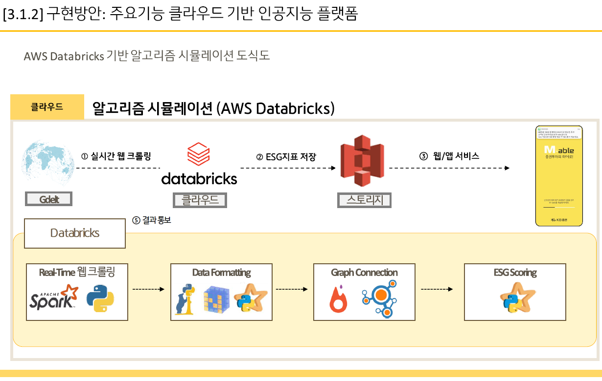

# ESG-investment with AI
### KB 디지털 아이디어 공모전 rank 4 - 우수상
***이 깃은 [Hack to the Future 2020](https://devpost.com/software/esg-ai) 대회에서 우승(Winner: Best Environmental Impact & Best User Experience)한 
[ESG_AI](https://github.com/hannahawalsh/ESG_AI)를 reference로 하고 있습니다.***
<br></br>
**웹데모 열기** [](https://share.streamlit.io/monouns/esg-ai-investment/korean-ver/main.py)  


## Project Flow
### 이 프로젝트는,
- s&p500d의 90% 기업이 매해 지속가능 보고서를 내고 있다.
- 그러나 기업의 ESG경영을 평가할 객관적 혹은 표준화된 방법 혹은 지표가 없다.
- 그래서 Gdelt에서 제공하는 데이터인 언론사의 어조 등을 통해, 데이터 시각화 및 ESG 점수 계산, 포트폴리오 제공 등의 서비스를 제시한다. 
- Gdelt에서 제공되는 기사 혹은 라디오 등의 어조 분석 데이터를 토대로 ESG scoring이 이루어진다.
- 포트폴리오는 Node2Vec알고리즘을 이용하여 유사 기업을 추출하고, Markowitz 포트폴리오 이론을 통해 사용자에게 투자 정보를 제공한다. 
<br></br>

## 원 깃헙 코드와의 차이점은?
### 마코위츠 포트폴리오 이론
- 마코위츠 포트폴리오 이론이라는 계량 경제학에서 사용되는 유명한 알고리즘을 통해 예시 포트폴리오 제공 서비스를 구현하였다.

### 시장 분석 및 주가 예측
- Gdelt뿐만 아니라, twitter crawling을 추가하여 시장 분석 및 주가 예측 서비스를 구현하였다.

**추가한 위 두가지 서비스를 통해, 사용자는 ESG투자를 할 때 더 유용한 정보를 얻을수 있다!**
<br></br>

## 데이터브릭스를 통한 웹 크롤링 
데이터 브릭스에 처음 가입하면, 14일간 무료로 사용이 가능하다.
PySpark라는 파이썬 기반 데이터 병렬분산처리를 통해 빅데이터를 실시간으로 빠르게 처리할 수 있다.
아래 순서를 따라 DataCreation폴더의 코드를 돌릴 수 있다.
 - Workspace 생성 - Open
 - Setting - Admin Console - Workspace Settings (Git, Web Terminal, DBGS File Browser를 Enable하는 것을 추천한다. 사용이 훨씬 편해진다!)
 - Compute - Cluster 생성 (데이터브릭스를 가입할 때 연결했던 클라우드의 컴퓨팅 서비스와 연결된다.)
 - Repos - 폴더 및 notebook 생성 (DataCreation 폴더를 사용하면 된다!)
 - Data - DFBS (데이터가 생성된 것을 확인할 수 있다.)
<br></br>

본 코드를 돌리는데 데이터브릭스에 설치가 필요한 페키지를 터미널에서 아래 명령어로 설치할 수 있다 :)
1. gdelt 설치할 때 에러가 발생하면 아래 명령어로 설치를 시도할 수 있다.
   ```bash
   python -m pip install gdelt --use-deprecated=backtrack-on-build-failures
   ```
2. 패키지 버전 문제가 생기면 아래 명령어로 재설치를 할 수 있다.
   ```bash
   pip install [pkg==ver] --force-reinstall
   ```

데이터 생성이 끝나면, 나의 로컬 컴퓨터로 데이터를 다운받을 수 있다. 
 - User Settings - Access Tokens - Generate New Token
 - local computer에 [Anaconda](https://www.anaconda.com/)를 설치한다.
 - Anaconda prompt를 열고 [databricks-cli](https://docs.databricks.com/dev-tools/cli/index.html)를 설치한다.
   ```bash
   python -m pip install databricks-cli
   ```
 - 자신의 데이터브릭스 host와 토큰을 입력해 주어야 한다.
   ```bash
   databricks configure --token
   ```
   - Workspace url로부터 host를 알 수 있다.
   - 아까 "User Setting"에서 생성한 토큰을 입력한다.
 - "databricks-cli"가 잘 설치되었는지 확인하려면 아래의 명령어를 입력한다.
   ```bash
   databricks fs -h
   ```
 - "databricks-cli"가 잘 설치되었다면, 데이터브릭스의 DBFS폴더로부터 데이터를 다운로드(copy)할 수 있다.
   ```bash
   databricks fs cp -r [spark file path] [your local directory path] 
   ```
 - 이제 이 데이터를 통해 local computer나 github에서 streamlit을 구동할 준비는 끝났다!
<br></br>

### Databricks를 사용하는 이유는?
Databricks는 Apache Spark 제작자가 설립한 미국 엔터프라이즈 소프트웨어 회사입니다.
Databricks는 자동화된 클러스터 관리 및 IPython 스타일 노트북을 제공하는 Spark 작업을 위한 웹 기반 플랫폼을 개발합니다.
[Wikipedia](https://en.wikipedia.org/wiki/Databricks)

***PySpark를 통해 데이터를 병렬분산처리하면서 빅데이터를 굉장히 빠른 속도로 핸들링이 가능하다!***

### 데이터 크롤링의 의미와 중요 포인트!
1. 12월이나 1월에 기업 평가 기사가 많이 나온다는 점을 이용하자.
   - 12월이나 1월을 포함하면 양질의 기업 평가 기사를 얻을 수 있다.

2. 한 기업에 대해 기사가 많이 크롤링 된다는 뜻은,  한 기업이 사회에 얼마나 영향력을 미치고 있는지를 나타내기도 한다. (ex. 421개의 Netflix ESG관련 기사가 나왔다.)
   - 즉, 크롤링된 기사의 수 자체만으로도 기업의 사회에 대한 파워를 알 수 있다.
<br></br>

### ESG scoring에 사용된 기술은?
***Gdelt와 PySpark!***
<br></br>

### 포트폴리오 구성에는 어떤 기술이 사용되었나?
***Node2Vec과 Markowitz Portfolio Theory!***

- Node2Vec에 대한 자세한 설명은 [여기](https://snap.stanford.edu/node2vec/)를 참고하세요.
- Markowitz Portfolio 이론에 대한 자세한 설명은 [여기](https://towardsdatascience.com/efficient-frontier-portfolio-optimisation-in-python-e7844051e7f)를 참고하세요.
<br></br>


## Web demo를 위한 Streamlit
### Streamlit 구현

1. 본인의 컴퓨터에서,
   - Pycharm을 설치하고 Anaconda 가상환경과 연결하자! (Anaconda 가상환경에 requirements.txt를 설치하면 된다.)
   - download_data.py, plt_setup.py, main.py를 PyCharm에 복사하고, main.py를 run하면 웹이 실행된다.
   - Anaconda prompt에서 streamlit을 구동하고 싶다면, 위 파일들을 복사해서 아래 명령어를 실행하면 된다.
     ```bash
     cd [your directory path]
     streamlit run main.py
     ```

2. URL 배포를 위한 Github과 Streamlit 연동
   - 먼저, requirements.txt와 .py파일을 github에 복사하자. (본 깃을 fork하면 쉽다.)
     - requirements.txt를 만들기 위해서는 아래 명령어를 사용하면 된다.
       ```bash
       pip freeze > requirements.txt
       ```
   - [streamlit.io](https://streamlit.io/)에 로그인 혹은 가입을 한다.
   - "New app"을 누르고 Github과 연동한다.
   - 몇 초 후면 바로 웹 url생성과 함께 웹 데모가 구동된다!


### 이 웹 데모로부터 얻을 수 있는 것은?
- 다양하게 시각화된 그래프와 차트를 통해 데이터를 직관적으로 해석할 수 있다.
   - Tone, ESG score 등의 정보에 대한 다양한 그래프가 제공되어 사용자가 편리한 것으로 선택해서 볼 수 있다.
<br></br>

## 사용 기술에 대한 세부 설명
1. 사용한 데이터베이스는?
   - Gdelt
   - Yahoo!의 Kalev Leetaru가 만든 GDELT 프로젝트 또는 이벤트, 언어 및 어조의 글로벌 데이터베이스입니다. 그리고 Georgetown University는 Philip Schrodt와 다른 사람들과 함께 스스로를 "모든 사람, 조직, 위치, 개수, 주제, 뉴스 소스를 연결하여 전 세계 모든 국가에 걸쳐 인간의 사회적 규모 행동 및 신념 카탈로그를 구축하기 위한 이니셔티브"라고 설명합니다. , 그리고 전 세계의 이벤트를 전 세계에서 일어나고 있는 일, 맥락 및 관련자, 전 세계가 이에 대해 어떻게 느끼는지를 매일 포착하는 하나의 거대한 네트워크로 통합합니다." GDELT의 생성으로 이어지는 초기 탐색은 2011년 1월의 컨퍼런스 페이퍼에서 공동 작성자인 Philip Schrodt가 설명했습니다. 데이터 세트는 Google Cloud Platform에서 사용할 수 있습니다.[Wikipedia](https://en.wikipedia.org/wiki/GDELT_Project)

2. Web 프로토타입 구현 방법은?

   
   
   
   
    
   
3. iShares로부터 기업 리스트 및 ticker 데이터를 받을 수 !
   - [Russell 1000 etf](https://www.ishares.com/us/products/239707/ishares-russell-1000-etf)
   - [MSCI UK etf](https://www.ishares.com/us/products/239690/ishares-msci-united-kingdom-etf)
   - [MSCI Canada etf](https://www.ishares.com/us/products/239615/ishares-msci-canada-etf)
   - [MSCI Australia etf](https://www.ishares.com/us/products/239607/ishares-msci-australia-etf)
   - You can get stock index whatever you want in ishares.com and just change url in DataCreation/python_get_data_wrapper
<br></br>


## Note
MIT Licence
